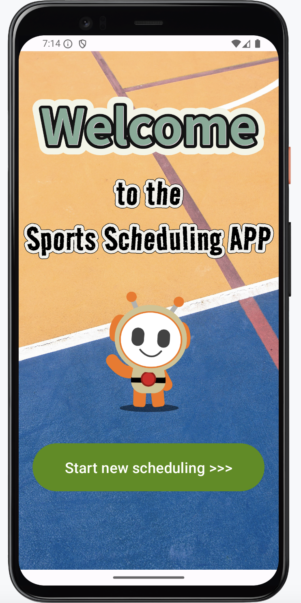
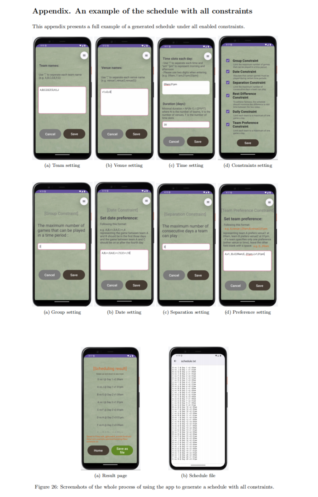

# Android-Based Multi-Constraint Intelligent Scheduling for Amateur Sports Competitions

This project implements an Android app that generates optimised sports schedules for amateur competitions using the Simulated Annealing algorithm.

## Project Structure

- `app/` – contains source code and layout XML files
- `gradle/` and `build.gradle.kts` – Gradle configuration
- `README.md` – project description and instructions

Detailed description of the project can be found here: [description](report.pdf)

Demo of the project could be found here: [demo](demo.mp4)

## How to Run

### 1. Open the Project
- Launch **Android Studio**
- Choose **"Open"** and select the root folder of this project (`Sports_Scheduling/`)

### 2. Let Gradle Sync
- Await Gradle Sync's completion
- Install any SDK components that are missing if prompted

### 3. Run the App
- Choose **Pixel 4 API 35** (or any available emulator/device)
- Click **Run ▶️** or press `Shift + F10`

### 4. Demo Usage
- Add teams, time slots, venues
- Configure constraints
- Click **"Generate"** to create a valid schedule
- Save result to local file

## App Preview

## Dependencies

All dependencies are configured via Gradle:
- Android SDK 34
- Kotlin
- RecyclerView
- Jetpack Components

## Notes
- Tested on Android Emulator (Pixel 4, API 35)
- App may take up to 60 seconds for larger problem instances
